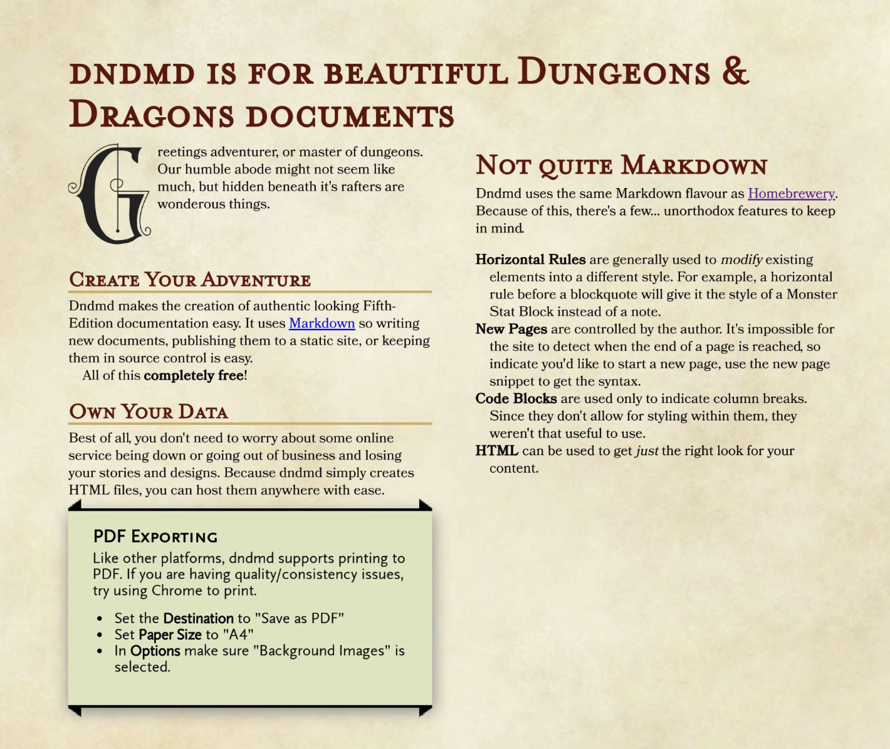

# dndmd is for beautiful D&mp;D documents

`dndmd` is a command line tool that parses markdown and outputs beautiful HTML
in the style of D&amp;D 5th Edition Player's Handbook.

It borrows heavily from [Homebrewery](https://homebrewery.naturalcrit.com/),
but is intended for use by those who want to use their regular editor and not
faff about with a web interface.

## Installation

```
npm install -g dndmd
```

## Usage

```
# print html output to stdout
$ dndmd input.md

# save html output to a file
$ dndmd input.md -o output.html

# watch input file and render output on every change
$ dndmd input.md -o output.html -w
```

## Output

The default output is styled to look like the Player's Handbook.



See more details in the [examples](./examples) directory.
